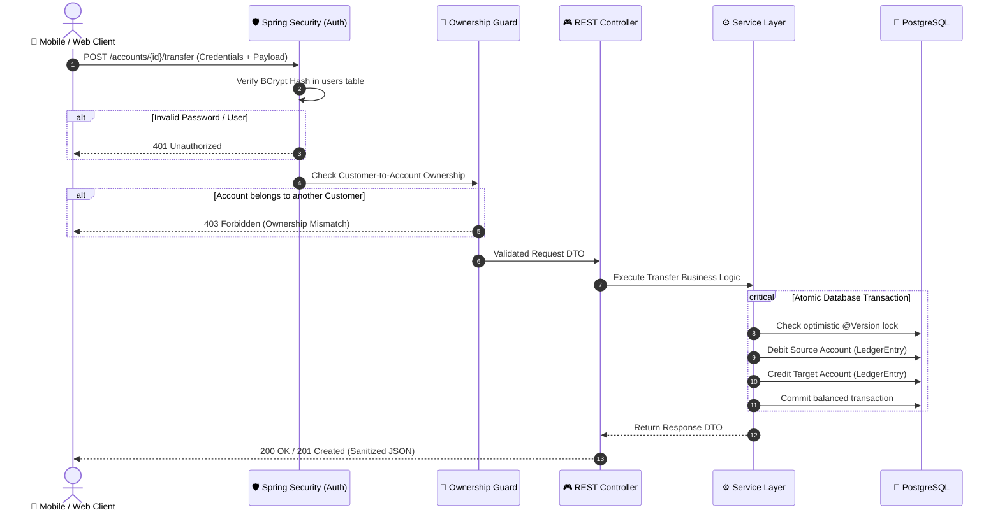
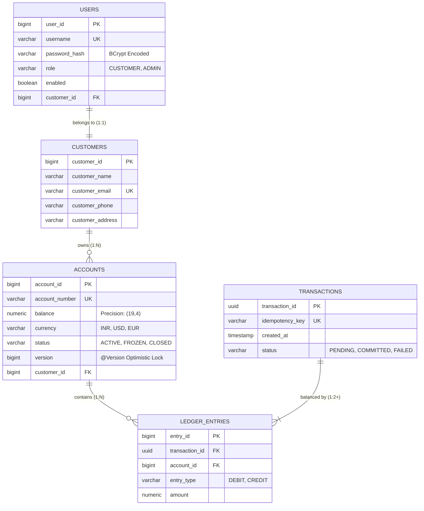
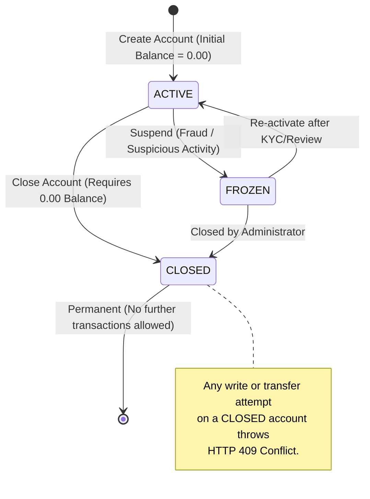
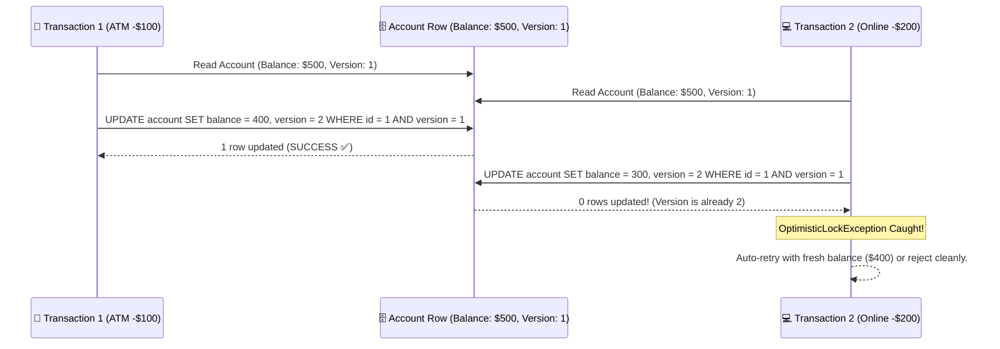

# 🏦 LedgerCore

> **A resilient, security-first banking backend and double-entry financial ledger engine built with Java 17 & Spring Boot 3.**

[](https://www.oracle.com/java/)
[](https://spring.io/projects/spring-boot)
[](https://www.postgresql.org/)
[](https://spring.io/projects/spring-security)
[](LICENSE)

---

## 📖 Table of Contents

- [Core Philosophy](#-core-philosophy)
- [System Architecture & Flow](#-system-architecture--flow)
- [Domain Model & Entity Relationships](#-domain-model--entity-relationships)
- [Authentication & Ownership Authorization](#-authentication--ownership-authorization)
- [Account Lifecycle State Machine](#-account-lifecycle-state-machine)
- [DTO & Data Integrity Pattern](#-dto--data-integrity-pattern)
- [Concurrency & Optimistic Locking](#-concurrency--optimistic-locking)
- [REST API Reference](#-rest-api-reference)
- [Project Directory Structure](#-project-directory-structure)
- [Double-Entry Ledger Roadmap](#-double-entry-ledger-roadmap)
- [Local Setup & Getting Started](#-local-setup--getting-started)

---

## 💡 Core Philosophy

Most backend tutorials build basic "CRUD" apps (Create, Read, Update, Delete). If a user wants $1,000, they just change the balance field to `$1000`. **In real banking, doing that causes financial collapse.**

LedgerCore is built on four non-negotiable rules:


```

┌───────────────────────────────┬────────────────────────────────────────────────────────────────────────┐
│ The Real-World Rule           │ How LedgerCore Enforces It                                             │
├───────────────────────────────┼────────────────────────────────────────────────────────────────────────┤
│ 🔑 The Keycard ≠ The Person   │ A User (login/password) is separate from a Customer (banking identity).│
│ 🚫 Never Trust the Client     │ The browser/app never tells the server its balance or account status.  │
│ 🔒 ID Guessing Impossible     │ Knowing Account #102 doesn't let you view it unless you own it.        │
│ ⚖️ Money Can't Spawn or Vanish│ Every transfer is balanced: Money removed from A MUST enter B.         │
│ 📜 Permanent Ledger History   │ Accounts are never deleted; state transitions are permanently audited. │
└───────────────────────────────┴────────────────────────────────────────────────────────────────────────┘

```

<p align="center">
  
</p>

---

## 🏗️ System Architecture & Flow

Every incoming HTTP request travels through a layered defense pipeline before touching the database.



---

## 🧩 Domain Model & Entity Relationships

The core database design completely decouples **Authentication Credentials** from **Banking Customers** and **Financial Accounts**.



---

## 🛡️ Authentication & Ownership Authorization

### 1. Separation of Identity (`User` vs `Customer`)

* **`User`**: Handles authentication secrets (`username`, `BCrypt` hash).
* **`Customer`**: Holds real-world profile data (`name`, `KYC`, `email`).
* **Why?** Allows changing login credentials or auth providers (OAuth2, LDAP, Passkeys) without modifying financial records.

### 2. Deep Ownership Verification

Standard CRUD apps blindly trust `/accounts/{accountId}` URL path variables. LedgerCore uses a custom authorization layer to ensure that **Logged-in User $\rightarrow$ Associated Customer $\rightarrow$ Valid Owner of Target Account**.

```
Request: GET /accounts/402
  │
  ├─ Authenticated As: "suleman" (User ID: 10)
  ├─ Mapped Customer: Customer ID 55
  └─ Database Query: Does Account 402 have customer_id == 55?
        ├── YES ──> Process & return AccountResponse DTO
        └── NO  ──> Reject immediately with HTTP 403 Forbidden

```

---

## 🚦 Account Lifecycle State Machine

Financial accounts cannot be deleted with a `DELETE` query because historical balances must remain mathematically auditable. Instead, accounts transition through a strict state machine:



---

## 📦 DTO & Data Integrity Pattern

Entities (`@Entity`) never leave the service layer. This prevents:

1. **Mass Assignment Vulnerabilities:** Attackers injecting `"balance": 9999999` in JSON.
2. **Password Leakage:** Returning sensitive password hashes or internal database IDs.
3. **Circular Reference Errors:** Infinite recursion during JSON serialization.

```
Incoming Request JSON
       │
       ▼
[ CreateCustomerRequest DTO ] ──► (Jakarta Bean Validation: @NotBlank, @Email, @Size)
       │
       ▼
[ Service Layer Mapping ]     ──► Converts valid DTO to Customer Entity
       │
       ▼
[ PostgreSQL Database ]       ──► Persisted with constraints & triggers
       │
       ▼
[ CustomerResponse DTO ]      ──► Sanitized projection returned to client

```

---

## ⚡ Concurrency & Optimistic Locking

In a bank, two transactions might hit the same account at the exact same millisecond (e.g., an ATM withdrawal and an online direct debit).

LedgerCore protects account balances using JPA Optimistic Locking (`@Version`):



---

## 📡 REST API Reference

### 👤 Customer Endpoints

| Method | Endpoint | Description | Auth Required | Status Codes |
| --- | --- | --- | --- | --- |
| `POST` | `/customer` | Register a new banking customer | No | `201 Created`, `400 Bad Request` |
| `GET` | `/customer` | Fetch all customers (Admin) | Yes (`ADMIN`) | `200 OK`, `401 Unauthorized` |
| `GET` | `/customer/{id}` | Get customer profile details | Yes | `200 OK`, `403 Forbidden`, `404 Not Found` |
| `PUT` | `/customer/{id}` | Update customer contact info | Yes | `200 OK`, `400 Bad Request`, `404 Not Found` |
| `DELETE` | `/customer/{id}` | Deactivate customer record | Yes (`ADMIN`) | `204 No Content`, `404 Not Found` |

### 🔑 User & Authentication Endpoints

| Method | Endpoint | Description | Auth Required | Status Codes |
| --- | --- | --- | --- | --- |
| `POST` | `/customer/{id}/users` | Create login credentials for customer | Yes | `201 Created`, `409 Duplicate Username` |

### 💳 Account Endpoints

| Method | Endpoint | Description | Auth Required | Status Codes |
| --- | --- | --- | --- | --- |
| `POST` | `/customer/{id}/accounts` | Open a new bank account (Currency specified) | Yes | `201 Created`, `400 Bad Request` |
| `GET` | `/accounts/{accountId}` | Fetch balance & account status | Yes (Owner) | `200 OK`, `403 Forbidden`, `404 Not Found` |
| `PATCH` | `/accounts/{id}/freeze` | Freeze an account temporarily | Yes | `200 OK`, `409 Invalid State Transition` |
| `PATCH` | `/accounts/{id}/close` | Permanently close an account | Yes | `200 OK`, `409 Conflict` |

---

## 📂 Project Directory Structure

```text
src/main/java/com/example/ledgercore/
├── config/
│   └── SecurityConfig.java              # Spring Security filter chain & password encoders
├── controller/
│   ├── CustomerController.java          # Customer management endpoints
│   ├── UserController.java              # User registration & auth endpoints
│   └── AccountController.java           # Account management & status endpoints
├── dto/
│   ├── request/                         # Strongly validated client input records
│   │   ├── CreateCustomerRequest.java
│   │   ├── CreateUserRequest.java
│   │   └── CreateAccountRequest.java
│   └── response/                        # Sanitized public API output records
│       ├── CustomerResponse.java
│       ├── UserResponse.java
│       └── AccountResponse.java
├── exception/
│   ├── GlobalExceptionHandler.java      # Centralized @RestControllerAdvice error mapping
│   ├── CustomerNotFoundException.java
│   ├── AccountNotFoundException.java
│   └── DuplicateUsernameException.java
├── model/
│   ├── Customer.java                    # Customer JPA Entity
│   ├── User.java                        # User/Auth JPA Entity
│   ├── Account.java                     # Account JPA Entity with @Version
│   ├── Role.java                        # CUSTOMER, ADMIN
│   ├── Currency.java                    # INR, USD, EUR, GBP
│   └── AccountStatus.java               # ACTIVE, FROZEN, CLOSED
├── repository/
│   ├── CustomerRepository.java
│   ├── UserRepository.java
│   └── AccountRepository.java
├── security/
│   ├── CustomUserDetailsService.java    # Database-backed user loading
│   └── AccountAuthorizationService.java # Ownership verification logic
└── service/
    ├── CustomerService.java
    ├── UserService.java
    └── AccountService.java

```

---

## 📈 Double-Entry Ledger Roadmap

The next phase of LedgerCore evolves from account management into an immutable **Double-Entry Financial Ledger Engine**:

```
Transfer ₹500 from Account A to Account B
════════════════════════════════════════════════════════════
1. Idempotency Check       ── Verify unique transaction key
2. Source Account Check    ── Status == ACTIVE, Balance >= ₹500
3. Target Account Check    ── Status == ACTIVE, Currency matches
4. Create Transaction      ── State = PENDING
5. Ledger Entry 1 (Debit)  ── Account A: -₹500.00
6. Ledger Entry 2 (Credit) ── Account B: +₹500.00
7. Balance Invariant Check ── Sum(Debits) == Sum(Credits)
8. Atomic Commit           ── State = COMMITTED
════════════════════════════════════════════════════════════

```

---

## 🚀 Local Setup & Getting Started

### Prerequisites

* **Java 17** or higher
* **Maven 3.8+**
* **PostgreSQL 14+**

### 1. Clone the Repository

```bash
git clone [https://github.com/SulemanAG/LedgerCore-.git](https://github.com/SulemanAG/LedgerCore-.git)
cd LedgerCore-

```

### 2. Configure Environment Variables

Never commit plain-text credentials to Git. Export your local database credentials:

```bash
# Linux / macOS
export DB_URL=jdbc:postgresql://localhost:5432/ledgercore_db
export DB_USERNAME=postgres
export DB_PASSWORD=your_secure_password

# Windows (PowerShell)
$env:DB_URL="jdbc:postgresql://localhost:5432/ledgercore_db"
$env:DB_USERNAME="postgres"
$env:DB_PASSWORD="your_secure_password"

```

### 3. Build and Run

```bash
# Using the Maven Wrapper
./mvnw clean spring-boot:run

```

The server starts on `http://localhost:8081` by default.

---

## 👨‍💻 Author

**Suleman Agasimani**

*Backend Engineering & Financial Systems Architecture*


```
